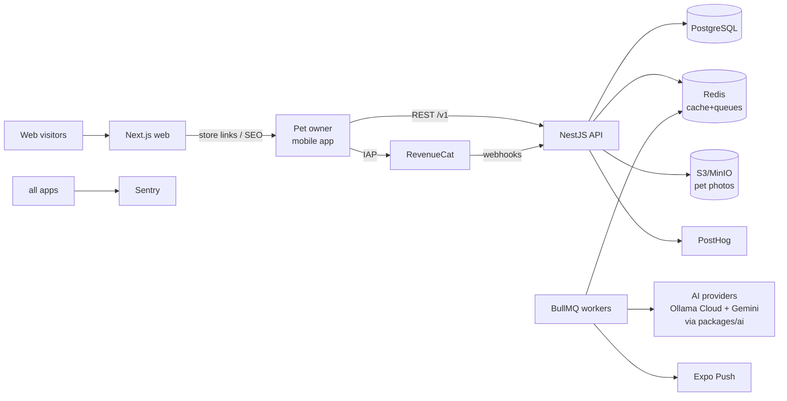
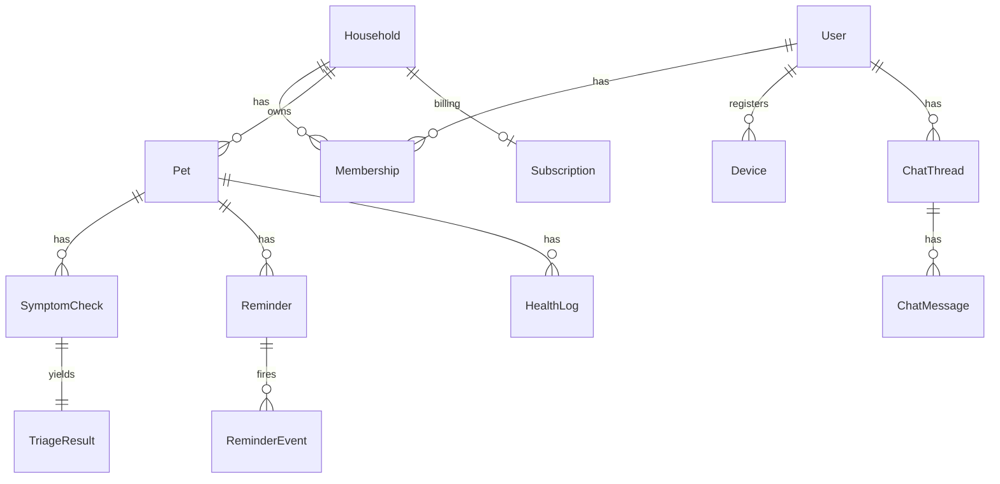
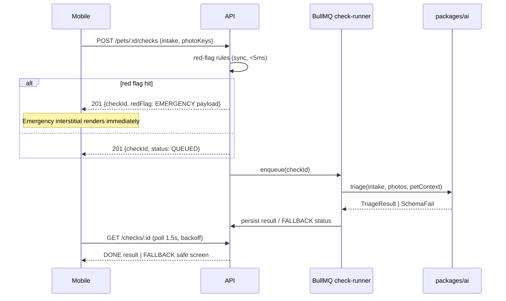

# Paw Care Right + — Architecture (HLD, build-ready)

Companion to `PRODUCT_SPEC.md`. Where a task card and this doc disagree, journal it and follow the task card.

## 1. System context

## 2. Containers & responsibilities

| Container | Responsibilities |
|---|---|
| `apps/api` | Auth, households, pets, checks, reminders, health logs, billing webhooks, chat, content endpoints. Enqueues all slow work. |
| workers (same deploy, separate process `apps/api/src/workers`) | `check-runner` (AI triage), `image-processor` (resize/EXIF-strip), `reminder-scheduler` + `push-sender`, `digest-builder`, `answer-cache-warmer` |
| `apps/mobile` | The product. Offline-tolerant reads (Query cache persisted to MMKV), optimistic completes for reminders, secure token storage. |
| `apps/web` | Marketing, programmatic SEO pages (SSG from `packages/data`), legal pages, read-only admin (basic auth + allowlist). |
| `packages/ai` | Provider abstraction, prompts, red-flag rules, TriageResult schema, eval harness (`pnpm test:ai-evals`). No app imports a vendor SDK directly (Ollama Cloud text+vision, Gemini images — see docs/AI_PROVIDERS.md). |
| `packages/data` | Versioned seed datasets: `breeds/`, `toxins/`, `care-templates/`, `regions/` (emergency + poison hotlines, vaccine protocol groups). |

## 3. Data model (Prisma — authoritative field lists live in schema.prisma; this is the shape)

Key tables & notable fields:
- **User**(id, email, appleSub?, googleSub?, locale, region, createdAt) — passwordless (email OTP) + Apple/Google.
- **Household**(id, name, ownerId) / **Membership**(userId, householdId, role: OWNER|MEMBER).
- **Pet**(id, householdId, species: DOG|CAT, breedSlug?, name, sex, neutered, birthDate?, ageEstimateMonths?, weightGrams?, photoKey?).
- **SymptomCheck**(id, petId, createdById, intakeJson, photoKeys[], status: QUEUED|RUNNING|DONE|FALLBACK, redFlagHit?, costMicroUsd).
- **TriageResult**(checkId, urgency, confidence, resultJson, modelId, promptVersion) — resultJson validated by Zod at write AND read.
- **Reminder**(id, petId, type, title, rrule, timezone, medNameAsEntered?, nextFireAt) / **ReminderEvent**(reminderId, dueAt, status: PENDING|SENT|DONE|SNOOZED|MISSED).
- **HealthLog**(id, petId, kind: WEIGHT|MEAL|NOTE|VET_VISIT|MED_GIVEN|CHECK_REF, valueJson, photoKeys[], occurredAt).
- **Subscription**(householdId, rcAppUserId, entitlement: FREE|PREMIUM, plan?, status, expiresAt, rawEventJson) — mirror of RevenueCat webhooks; **server is the entitlement oracle**.
- **Device**(userId, expoPushToken, platform, lastSeenAt).
- **AnswerCache**(key: species+normalizedItem, verdict, answerJson, hitCount) — F3 global cache.

Indexes: every FK; `SymptomCheck(petId, createdAt desc)`; `ReminderEvent(dueAt, status)`; `HealthLog(petId, occurredAt desc)`; `AnswerCache(key unique)`.

## 4. API surface (v1 — all under /v1, JWT unless marked public)

| Area | Endpoints |
|---|---|
| auth | `POST /auth/otp/request` (public), `POST /auth/otp/verify` (public), `POST /auth/social` (public), `POST /auth/refresh`, `POST /auth/logout`, `POST /devices` |
| households | `GET /households/me`, `POST /households/invites`, `POST /households/invites/accept`, `DELETE /households/members/:id` |
| pets | `GET/POST /pets`, `GET/PATCH/DELETE /pets/:id`, `POST /pets/:id/photo-upload-url`, `GET /breeds?species=&q=` (public, cached) |
| checks | `POST /pets/:id/checks` → `{checkId}`, `GET /checks/:id` (poll; includes status), `GET /pets/:id/checks`, `POST /checks/:id/followup` (better/same/worse) |
| food | `GET /food-safety?species=&item=` (free-tier metered) |
| reminders | `GET/POST /pets/:id/reminders`, `PATCH/DELETE /reminders/:id`, `POST /reminder-events/:id/complete|snooze`, `GET /agenda?from=&to=` |
| health | `GET/POST /pets/:id/logs`, `GET /pets/:id/weight-series`, `GET /pets/:id/vet-summary` |
| chat | `POST /chat/threads`, `POST /chat/threads/:id/messages` (SSE stream), quota headers |
| billing | `POST /billing/rc-webhook` (public+signed), `GET /billing/entitlement` |
| meta | `GET /health` (public), `GET /config` (public: min app version, paywall variant, hotline pack version) |

Conventions: cursor pagination (`?cursor=&limit=`), global error format, idempotency keys on `POST /checks` and webhook handler, rate limits per route class (auth 5/min/IP; checks 10/day free-metered; food 60/min).

## 5. Symptom check sequence

## 6. Queues (BullMQ)

| Queue | Job | Notes |
|---|---|---|
| `checks` | run triage | concurrency small; retry 2 with jitter; on final fail → FALLBACK status (never guess) |
| `images` | resize→1600px, thumb 320px, EXIF strip, moderation pre-check | triggered by S3 upload confirm |
| `reminders` | scan `ReminderEvent(dueAt<=now, PENDING)` every minute → enqueue pushes; recompute nextFireAt via rrule in the reminder's timezone | idempotent by event id |
| `push` | Expo send + receipt check | batch 100; prune dead tokens |
| `digests` | monthly per-household summary | premium only |

## 7. Environments & config

- `local` (docker compose) → `staging` → `production`. All config through Zod-validated env (`packages/config/env`). Secrets never in repo; `.env.example` lists every key with fake values.
- Mobile builds: EAS profiles `development`, `preview`, `production`; OTA via EAS Update channels mapped to the same three — full system in `docs/OTA_UPDATES.md`.
- Migrations: `prisma migrate` in CI against a shadow DB; production migrations run manually at milestone deploys (human action, documented in runbook T106).

## 8. Non-functional targets

- API p95 < 300ms (non-AI routes); check end-to-end ≤ 12s p90 (photo) / 8s p90 (text).
- Push accuracy: reminder fires within 60s of due time, timezone-correct across DST (tested in T062).
- Cold start (mobile) < 2.5s mid-range Android; bundle audited at T095.
- Coverage: ≥80% on api services + packages/ai; critical mobile flows snapshot/component-tested.
- Availability: graceful degradation — if AI provider is down, food lookups serve cached/dataset answers and checks return the safe fallback; reminders unaffected.
