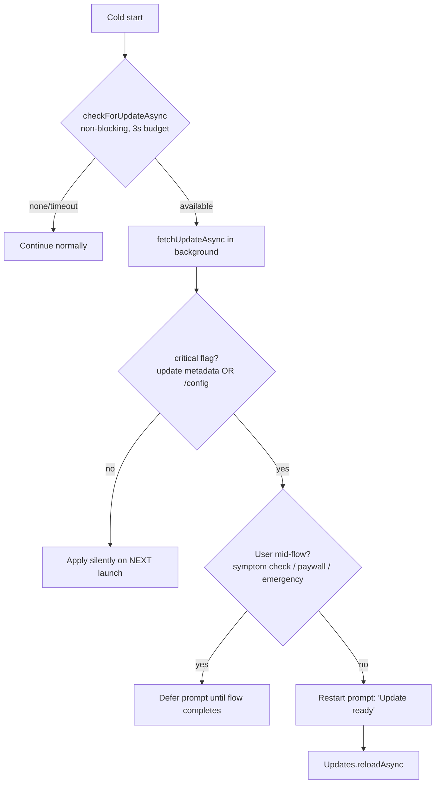

# Paw Care Right + — OTA Code Update System (EAS Update)

The mobile app is React Native (Expo). This document defines how **JS/asset code updates ship over-the-air** without store review, how staged rollouts and rollbacks work, and the safety rules that govern every publish. Tasks T113–T118 implement it. `docs/PHASES.md` cards win on conflicts.

## 1. Tooling & channel model

**Engine:** `expo-updates` + EAS Update. One channel per environment, mapped to EAS Update branches:

| Channel | Bound to | Receives updates from | Audience |
|---|---|---|---|
| `development` | dev client builds | any branch (manual) | devs |
| `preview` | TestFlight / Play internal builds | auto-publish on push to `main` (CI) | founder + testers |
| `production` | store builds | manual promote only (CI job with confirmation input) | users |

**Runtime version policy: `fingerprint`.** An OTA update can only be delivered to binaries whose native layer matches the fingerprint it was built against. Practical rule for the loop and the founder: **if a change touches native deps, config plugins, permissions, icons/splash, or Expo SDK version → the fingerprint changes → it's a store binary release, not an OTA.** CI computes and prints the fingerprint diff on every PR so this is never a surprise.

## 2. Update decision matrix

| Change type | Ships via | Rollout |
|---|---|---|
| JS/TS logic, screens, styles, copy, images-in-bundle | **OTA** (EAS Update) | staged 10% → 50% → 100% |
| Native module / permission / SDK / config plugin | **Store binary** (EAS Build → review) | store release train |
| Paywall variant, kill switches, hotline pack, min versions | **Server** (`/config`) | instant |
| Backend behavior (triage prompts, rules, quotas) | **API deploy** | instant, server-side |

Note: AI prompts and red-flag rules run **server-side** — they are never shipped in the app bundle, so triage safety changes don't depend on OTA adoption.

## 3. In-app update flow

- Foreground re-check on `AppState → active`, throttled to once per 6h (persisted timestamp).
- **Never** interrupt an in-progress symptom check, the Emergency interstitial, checkout, or onboarding with a reload — the deferral guard is a hard rule with tests.
- `critical: true` is set at publish time (update message convention `[critical]`) and mirrored in `/config.criticalOtaVersion` as a belt-and-braces signal for clients that fetched before the flag.

## 4. Forced binary upgrade (OTA can't fix native)

`/config` already carries `minAppVersion` per platform. Below it → full-screen blocking upgrade screen with store deep link (no dismiss), copy explains why. Between `minAppVersion` and `recommendedAppVersion` → dismissible banner. This is the escape hatch when a fingerprint-incompatible fix must reach users.

## 5. Client–server contract skew (the real OTA risk)

An OTA can ship a client expecting API behavior the backend doesn't have yet (or the reverse), and adoption is gradual — old and new JS coexist for days. Rules:

1. **API changes are additive-only** within a runtime fingerprint generation; removals/renames wait for a binary release cycle.
2. **Versioned payload schemas:** intake payloads carry `schemaVersion`; the API accepts version N and N−1 (contract tests enforce).
3. **Deploy order:** backend first, then OTA publish. The CI promote job checks `GET /health` includes the required API build id before allowing a production publish.
4. `/config` responses are backward-compatible by construction (Zod schema with defaults on the client).

## 6. Staged rollout & rollback playbook

**Publish (production):** CI manual job → full gates (typecheck/lint/test/build + `test:ai-evals`) → `eas update --branch production` → immediately constrain via `eas channel:rollout` to **10%**.

**Promotion criteria (per step, minimum 12h at 10%, 12h at 50%):**
- Sentry crash-free sessions ≥ 99.5% for the new `updateId`
- API error rate and triage fallback rate flat vs. previous update
- `ota_applied` adoption curve normal (no stuck-download spike)

**Rollback:** halt rollout → `eas update:republish` the previous known-good update group on `production` → verify adoption of the republished group → incident entry in journal + `docs/qa/incidents/`. Server kill switches (`/config`: checks/chat/paywall) remain the instant mitigation while OTA rollback propagates.

## 7. Observability

- Sentry: release = `pawcareright@{appVersion}+{updateId}`; `Updates.updateId` and channel set as tags at boot → crash-free is measurable **per OTA update**, not just per binary.
- PostHog: `ota_available`, `ota_downloaded`, `ota_applied {updateId, fromUpdateId, latencyMs}` → adoption dashboard (time-to-90%).
- `/v1/meta/client-versions` (admin-read) aggregates reported `{appVersion, updateId}` per day for the T111 dashboard.

## 8. Safety rules for publishes (absolute)

1. Every OTA publish passes the **full CI gate suite** — identical to milestone gates, including `test:ai-evals` (client changes can alter intake construction, which feeds triage).
2. No OTA may weaken Safety Policy surfaces: `<VetDisclaimer/>` presence snapshots and Emergency interstitial flow tests are required-green for the publish job specifically.
3. Production publishes are **human-triggered only** (CI manual dispatch with typed confirmation `PUBLISH-PROD`); the autonomous loop may publish to `preview` at milestone gates but never to `production`.
4. Update descriptions follow `Txxx/Mx: summary [critical?]` so every shipped bundle maps to journal history.
